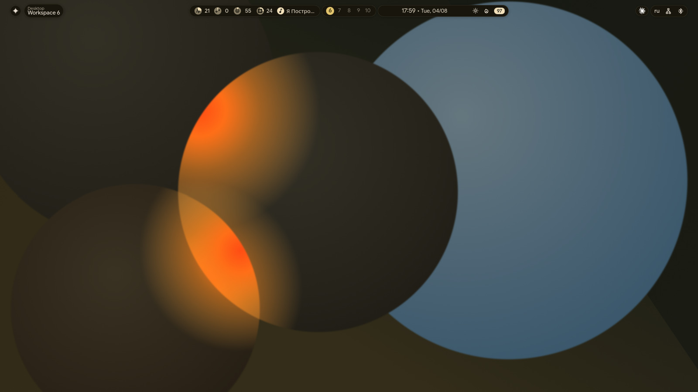
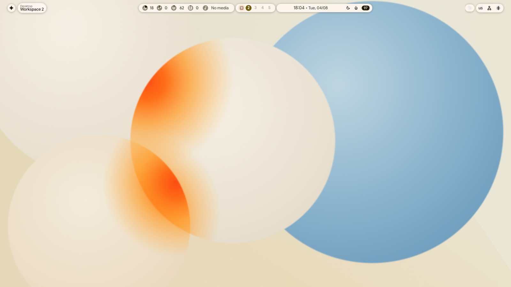
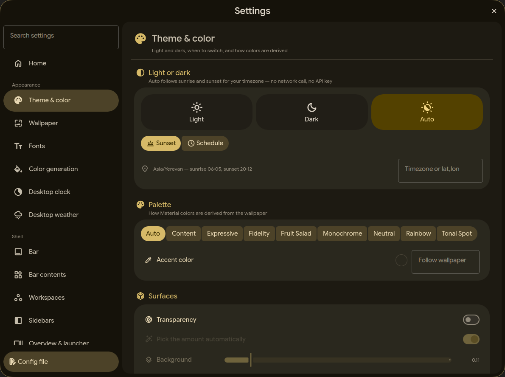
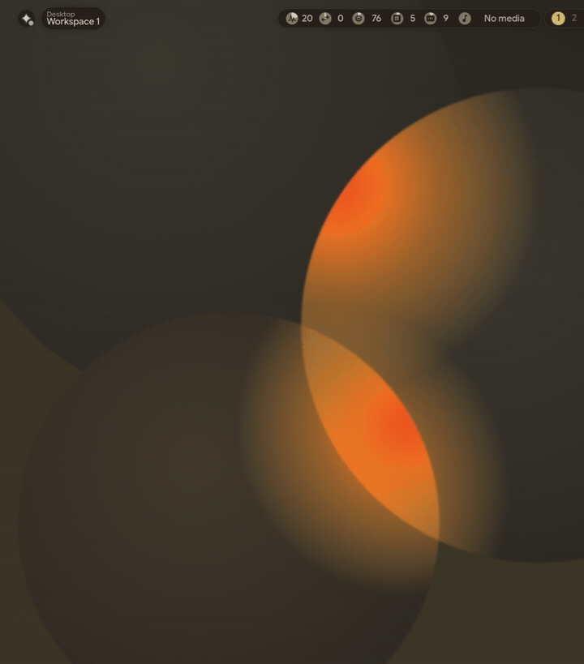
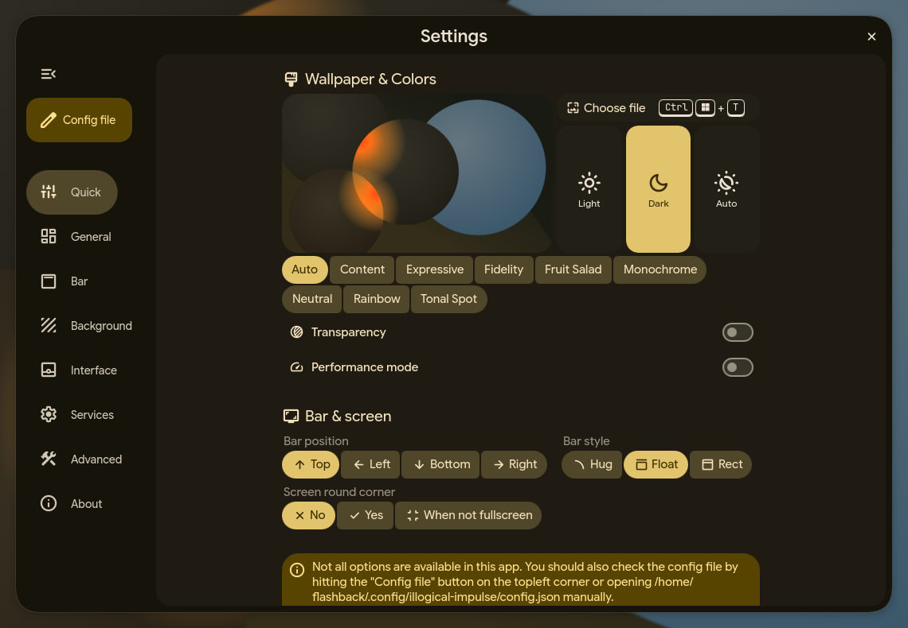
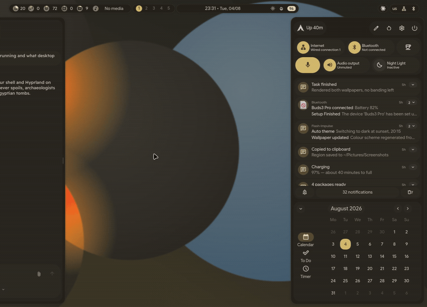
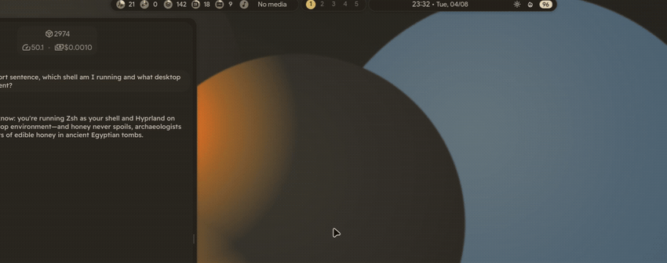
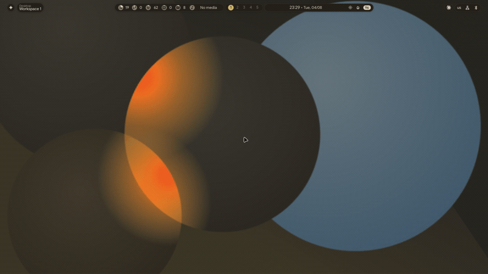
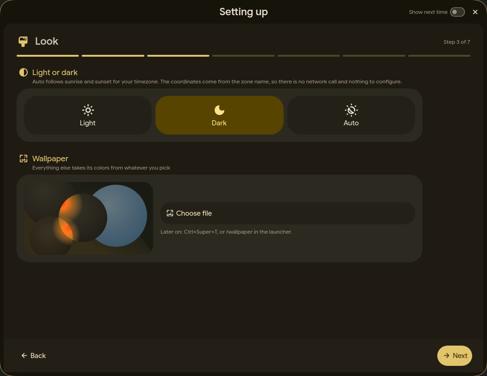
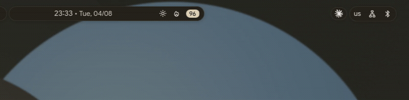

<div align="center">

# Flash-Impulse

**A Hyprland desktop built on Quickshell — with an AI sidebar that can actually do things.**

Material 3 Expressive throughout, a shell that reads your hardware straight from sysfs,
and a chat panel that runs shell commands behind a three-tier safety review.



</div>

By [flashback7766](https://github.com/flashback7766), built on
[better-ii-ai](https://github.com/flashback7766/better-ii-ai) and on the upstream desktop
credited at the bottom.

> **Status:** working desktop, AI stack integrated. See [ROADMAP.md](ROADMAP.md).

---

## Look

The wallpaper, the icon and the palette are original artwork ([`brand/`](brand)), drawn as
vectors and rendered in float so the gradients do not band. Light and dark are the same
composition — only the ground changes — and the shell swaps between them with the theme.

| Light | Dark |
|---|---|
|  |  |

**Follow the sun.** Light while it is up, dark once it sets. The coordinates come from your
system timezone — a zone name is a city, and `zone1970.tab` ships that city's latitude and
longitude — so there is no network call, no API key and nothing to configure. Or set two
times yourself. Switching is edge-triggered: override the theme by hand at midnight and it
stays overridden until sunrise.

<div align="center">

</div>

## The AI sidebar

Multi-provider chat (Gemini, OpenAI, Anthropic, any local OpenAI-compatible server) with
streaming, attachments, context compression, rotating history and live cost tracking.
It calls tools — reads files, runs commands, edits configs — and every command goes
through a whitelist / blacklist / model-judge pipeline before it runs, with the decision
written to an audit log.

<div align="center">

</div>

**Claude Code as a backend.** The `Claude Code · *` models drive the local `claude` CLI
instead of the HTTP API, so your Claude **subscription** powers the sidebar — no API key,
Claude Code's own tool suite and permission system, and sessions that survive across
messages via `--resume`.

Current roster (July 2026): Gemini 3.5 Flash-Lite (default, free tier), Gemini 3.6 Flash,
Claude Sonnet 5 / Opus 4.8 / Fable 5, GPT-5.6 Luna/Terra/Sol.

## Settings

Every option the shell has, in one place — thirty-odd pages of one topic each, grouped
into Appearance / Shell / System / Services, with a search field that flattens the whole
tree into a single result list. Nothing is left for the config file: the pages that used
to say "check config.json for the rest" no longer have a rest to point at.

<div align="center">

</div>

First run opens a wizard instead — language, look, layout, performance, privacy, one
screen at a time, with the step count in the corner.

## The rest of the shell

Nothing here just cuts in or out — every open, close and state change is a real animation,
timed to feel immediate rather than decorative.

<table>
<tr>
<td width="50%"><br>
<sub><b>Right sidebar</b> — quick toggles, grouped notifications, calendar, to-do, timer,
volume mixer, Wi-Fi and Bluetooth pickers.</sub></td>
<td width="50%"><br>
<sub><b>Launcher & overview</b> — apps, commands, a calculator and web search in one field,
over a live workspace grid.</sub></td>
</tr>
<tr>
<td width="50%"><br>
<sub><b>Session menu</b> — the blur expands from the middle instead of the screen just
cutting to it, and the buttons cascade in behind it.</sub></td>
<td width="50%"><br>
<sub><b>First run</b> — a wizard, one decision per screen, with the step count in the
corner instead of one long scroll.</sub></td>
</tr>
</table>

<div align="center">

<br><sub>A notification landing — the bell badge on the bar pops in with it rather than
appearing pre-formed.</sub>
</div>

**Real hardware readouts in the bar** — CPU (htop-style per-thread aggregate), temperature,
frequency, GPU load and temperature, VRAM, system power draw (and charge rate once you plug
in). All read straight from sysfs, with zero processes spawned on the polling path.

## Install

```bash
git clone https://github.com/flashback7766/Flash-Impulse
cd Flash-Impulse
./install.sh
```

Supported: Arch / CachyOS (tested), other pacman-based distros and Fedora (best effort).

Run bare on a terminal, that opens a wizard — pick components with the arrow keys and
space, decide what happens to an existing install, and see exactly what will change on a
review screen before anything is written. A timestamped backup of every config directory
the install can touch is taken first.

The wizard only covers *choosing*. Once you confirm, it tears down and the install runs on
the normal terminal, because package managers need to show their output and may stop on a
sudo prompt — there is no honest way to render that inside a managed screen.

Given a command or a flag, or with output redirected, it behaves like any other CLI
instead:

```bash
./install.sh -y                  # no wizard: install everything, keep custom configs
./install.sh doctor              # distro, tools, keys, install state (exit 4 if lacking)
./install.sh doctor --json       # same, machine-readable
./install.sh secrets set gemini  # store an API key in the system keyring
./install.sh backups             # list pre-install backups
./install.sh rollback            # restore the latest backup
./install.sh install --dry-run   # walk the whole flow, change nothing
./install.sh help install        # per-command help
```

Exit codes are meaningful: `0` ok, `1` failed, `2` bad usage, `3` cancelled, `4` missing
dependency. Colour follows whether stdout is a terminal, and `--color always|never|auto`
overrides that.

The whole thing is bash and ANSI with no dependencies — it has to run before the packages
it installs exist, so it cannot lean on `gum`, `dialog` or `whiptail` being present.

Power users can drive the underlying engine directly via `./setup` (inherited from
upstream, still fully functional).

RU layout is shipped by default — `us,ru` with Alt+Shift to toggle.

Config lives in `~/.config/flash-impulse/config.json`. An install that predates the
rename is moved across on upgrade, entry by entry, and nothing already in the new
directory is overwritten.

## AI quick start

Open the left sidebar and just type.

| Command | Effect |
|---|---|
| `/model NAME` | switch model (`Ctrl+1..9` for quick switch) |
| `/key VALUE` | store the API key for the current provider |
| `/tool functions\|search\|none` | select tool mode |
| `/yolo on\|off` | auto-approve **all** AI shell commands (risky) |
| `/new`, `/clear`, `/save`, `/load` | chat management |

For the Claude Code models, install the [claude CLI](https://claude.com/claude-code) and log
in once — `./install.sh doctor` will tell you if anything is missing. Logs live in
`~/.local/share/flash-impulse/logs/`.

Architecture details: [docs/ai-architecture.md](docs/ai-architecture.md), and the full
sidebar reference in [AI_SIDEBAR.md](AI_SIDEBAR.md).

## Running on older hardware

```bash
~/.config/hypr/hyprland/scripts/performance-mode.sh on     # or off / toggle / status
```

Blur costs roughly `passes × radius × area`, so the profile drops it from 3 passes at radius
10 to 1 at 4 — still frosted, around an order of magnitude less fill rate. It also disables
window shadows (`render_power 10` is a very soft, very expensive falloff), shortens every
animation to 60% of its duration, and halves the resource polling rate. Layout, rounding,
spacing and colours are untouched.

The setting persists in `~/.config/hypr/custom/variables.lua` as `performanceMode`, so it
survives reloads and updates.

Worth knowing before blaming the shell for GPU load: at idle this desktop draws **0%** GPU.
Spikes come from whatever window is actively repainting (Electron apps are the usual
suspect) and from brief panel animations — not from the bar sitting there.

## Credits & license

- [end-4/dots-hyprland](https://github.com/end-4/dots-hyprland) — the illogical-impulse
  desktop this fork stands on. Огромное спасибо.
- [better-ii-ai](https://github.com/flashback7766/better-ii-ai) — the enhanced AI sidebar
  that got merged in.

GPL-3.0, same as upstream. See [LICENSE](LICENSE).
